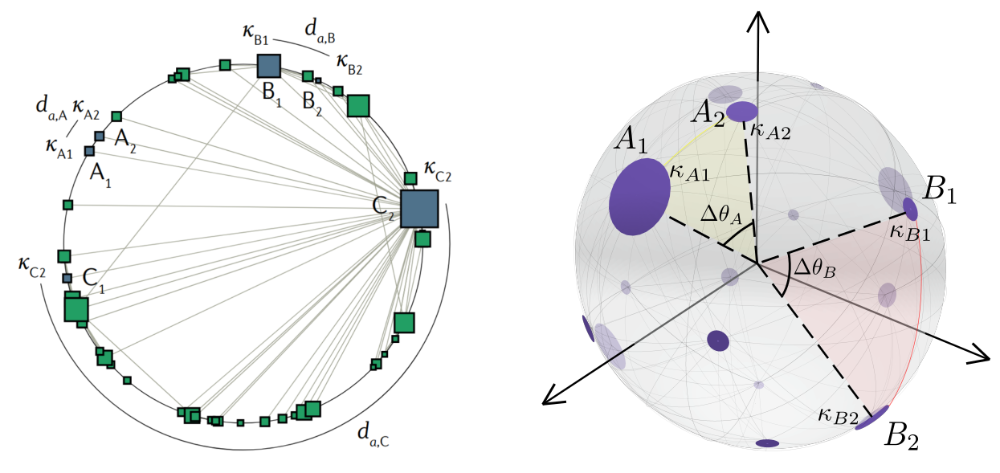

# Geometric soft configuration model $S^D/H^{D+1}$



<p align="center">
<i>Schematic representation of the $S^D$ model for D=1 (left) and for D=2 (right)</i>
</p>

## Table of content

1. [Multidimensional network model](#multidimensional-network-model)
2. [Usage](#usage)
3. [Examples](#examples)
4. [Publications](#publications)


# Multidimensional network model

The $\mathbb{S}^D$ model is the geometric soft configuration model
which is able to explain many fundamental features of real networks such as
small-world property, heterogeneous degree distributions, high level of
clustering, and self-similarity.

In the $\mathbb{S}^D$ model, a node $i$ is assigned two hidden variables: 
- a hidden degree $\kappa_i$, quantifying its popularity, influence, or importance, 
- a position in $D$-dimensional similarity space chosen uniformly at random, 
  and represented as a point on a $D$-dimensional sphere. For instance for $D=1$ 
  the similarity space is represented as a circle, for $D=2$ as a sphere (see Figure above).

The connection probability between any pair of nodes increases with
the product of their hidden degrees (i.e., their combined popularities),
and decreases with the angular distance between the two nodes.
Specifically, nodes $i$ and $j$ are connected with the probability

$$p_{ij} = \left(1 + \frac{(R\Delta\theta_{ij})^\beta}{\left(\mu \kappa_i \kappa_j\right)^{\frac{\max(D, \beta)}{D}}}\right)^{-1}$$

where $\Delta\theta_{ij}$ is the angular distance between nodes $i$ and $j$. 
Parameters $\mu$ and $\beta$ (also called inverse temperature) control the
average degree and the clustering coefficient, respectively.

The $\mathbb{S}^D$ model can be expressed as a purely geometric model
$\mathbb{H}^{D+1}$ in the hyperbolic space by mapping the hidden degree of
each node into a radial coordinate as

$$r_i = \hat{R} - \frac{2\max(D, \beta)}{D\beta \zeta} \ln\left(\frac{\kappa_i}{\kappa_0}\right)  \text{  with  }  \hat{R} = \frac{2}{\zeta} \ln \left(\frac{2R}{(\mu \kappa_0^2)^{\frac{\max(D, \beta)}{D\beta}}}\right)$$

where $\hat{R}$ is the radius of the hyperbolic disk and $\zeta = \sqrt{-K}$ and $K$ is the constant negative curvature of the hyperbolic disk. For $\beta < D$ we choose $\zeta=\frac{1}{\beta}$ and $\beta > D$ we set $\zeta=1$. The connection probability then reads

$$p_{ij} = \frac{1}{1 + e^{{\frac{\beta\zeta}{2} (x_{ij} - \hat{R})}}}$$

where

$$x_{ij} = r_i + r_j + 2\ln \frac{\Delta\theta_{ij}}{2}$$

is a good approximation of the hyperbolic distance between two nodes separated
by an angular distance $\Delta\theta_{ij}$ with radial coordinates $r_i$ and $r_j$.


# Usage

There are two types of possible usage:

1. Generate synthetic networks with specified parameters
2. Infer a set of hidden degrees and parameter $\beta$ from the input network. Based on them generate synthetic networks from the model.


**Ad. 1.**

Compile code (c++17 or higher is required)
```
g++ -O3 -std=c++17  src/generatingSD_unix.cpp -o generateSD
```

Run the code
```
./generateSD -d <dimension_value> -b <beta_value> -n <network_size> -g <gamma> -k <mean_degree>
```

The program accepts the following parameters:
- `-d` - Dimension of the model
- `-b` - Value of the inverse temperature $\beta$ (positive value)
- `-n` - Size of the network
- `-g` - Exponent of the power-law distribution for hidden degrees.
- `-k` - Mean degree of the network

The set of kappas will be generated from the power-law degree distribution with specified $\gamma$ value, i.e., $P(\kappa) \sim \kappa^{-\gamma}$. 

If you want to use your own set of kappas, you can run code as

```
./generateSD -d <dimension_value> -b <beta_value> -l <path_to_kappas>
```

In this case parameters `-n`, `-g`, and `-k` are unnecessary.


**Ad. 2.**

Compile code (c++17 or higher is required)
```
gfortran -O3 include/trapecis_Sd.f -c -o include/trapecis_Sd.o
g++ -O3 -std=c++17 -lgfortran -I include/ include/trapecis_Sd.o  src/infer_kappas_beta_unix.cpp -o infer_kappas_beta
```

Infer the hidden degrees and parameter $\beta$ 
```
./infer_kappas_beta -d <dimension_value> <edgelist_filename>
```

The code generates two files:
- `.inf_log` with network information and value of inferred $\beta$
- `.kappas` with a set of inferred hidden degrees

Later you can use `.kappas` file as the input to the `./generateSD` program. See Ad. 1 for more information.


# Examples 

_See also [tutorial](notebooks/tutorial.ipynb)_

**Generate network with specified parameters:**

```
./generateSD -d 1 -b 1.5 -n 100 -g 2.7 -k 10
```
It will create a $\mathbb{S}^1$ model with 100 nodes. The $\beta$ parameter is set to 1.5 
and the exponent of the powerlaw distribution of the hidden degrees is 2.7 with a mean value of 10.


**Generate network with predefined hidden degrees:**
    
```
for i in `seq 1 1000`; do; echo 10; done > kappas.txt
./generateSD -d 2 -b 3 -l kappas.txt
```
It will create a $\mathbb{S}^2$ model with 1000 nodes. The $\beta$ parameter is set to 3 
and all nodes with hidden degree $\kappa=10$.


**Infer hidden degrees and parameter $\beta$ from a real network and generate network replicas**

```
./infer_kappas_beta -d 2 <path to edgelist>
./generateSD -d 2 -b <inferred beta> <path to .kappas file>
```

It will create a $\mathbb{S}^2$ model with size of input network `<path to edgelist>` with inferred set of $\kappa$-s and parameter $\beta$.

# Publications

- [Serrano, M. Á., Krioukov, D., & Boguná, M. (2008). Self-similarity of complex networks and 
  hidden metric spaces. Physical review letters, 100(7), 078701.](https://journals.aps.org/prl/abstract/10.1103/PhysRevLett.100.078701)

- [Krioukov, D., Papadopoulos, F., Kitsak, M., Vahdat, A., & Boguná, M. (2010). Hyperbolic 
  geometry of complex networks. Physical Review E, 82(3), 036106.](https://journals.aps.org/pre/abstract/10.1103/PhysRevE.82.036106)

- [García-Pérez, G., Allard, A., Serrano, M. Á., & Boguñá, M. (2019). Mercator: uncovering 
  faithful hyperbolic embeddings of complex networks. New Journal of Physics, 21(12), 123033.](https://iopscience.iop.org/article/10.1088/1367-2630/ab57d2)

- [Jankowski, R., Allard, A., Boguñá, M., & Serrano, M. Á. (2023). The D-Mercator method for the 
  multidimensional hyperbolic embedding of real networks. Nature Communications, 14(1), 7585.](https://www.nature.com/articles/s41467-023-43337-5)